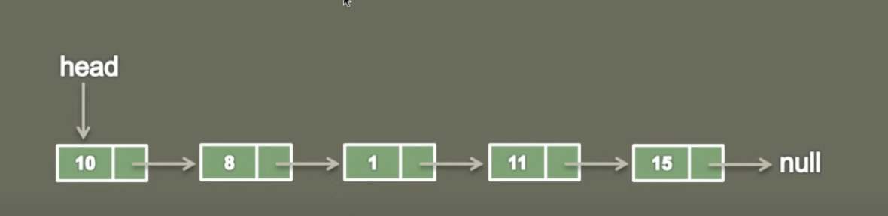

#
- We first talk about the Singly Linked List 
#
Singly linked List is a data structure used for storing collection of nodes and has following properties
- It contains sequence of nodes
- A node has data and reference to next node in a list.
- First node is the head node.
- Last node has data and points to null.

#
Implementation of a ListNode in Singly Linked List
- Now we will see the implementation of the ListNode in Singly Linked List.
-
```
// Generic Type 
// The list node is holding the data which is Generic Type
public class ListNode<T>{
    private T data;
    private ListNode<T> next;
}

// Integer Type 
// This snippetis you can see that it is holding the data of integer type data
public class ListNode{
    private int data;
    private ListNode next;
}
```

So if see the graphical representation of it looks something like this 

#
> the ListNode is having a data  and o the next node in the list 
- We will be createing the next lesson  a list node with the int type data 
- You can also provide any generic type data which you want!

- so here you can see that how we actually represent a Singly Linked List

#
- Inside SLI first we have this node which has a data and a pointer to the next node in the list
- And this chain goes to the last node because last node points to null.
- In order to hold this complate list we usually create a list node by name head
- And the head is the first node was actually holds complate linked list.
- Okay, let's go to VsCode and see the implementation of SLL and also the ListNode
