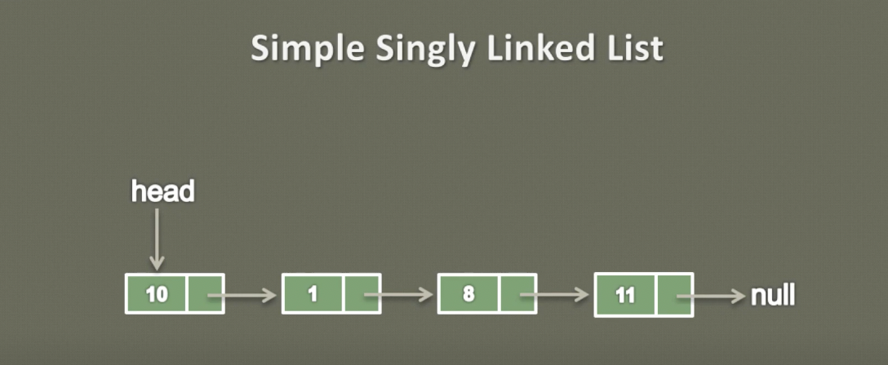
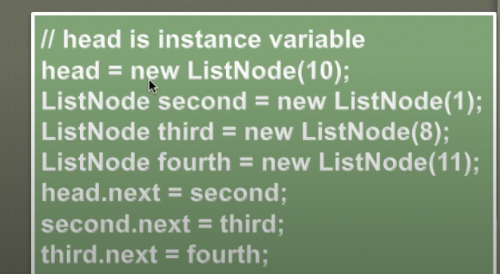

## Simple Singly Linked List
- So here you can see a simple singly linked list

#
- In our old lesson we learned what is a singly linked list.
- We learned that a singly linked list is a data structure which actually stores collection of data.
- It contains sequence of nodes, so here you can see that there are four nodes having data 10,1,8 and 11.
- And you can also see the first node is being referred to by the head
- We also learned that node is having two properties one is the data property and one is the reference to the next node in the list.
- Let's see a demo of how to create a singly linked list having the data as 10,1,8 and 11.
- So, here is the code which can add few nodes in the singly linked list.

#
- We will also learn the other ways to insert the node into the singly linked list.
- So let's see the demo of the code step by step
- so when we intialize a singly linked list
- it contains an instance varriable head which is of type ListNode 
- and when we intialize the singly linked list usually head points to null.
- Because at the intialization of the singly linked list there are no elements in to to the list
- So at first head points to null [head->null]
- 