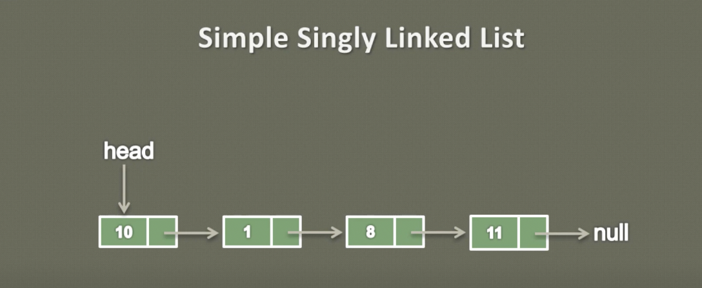
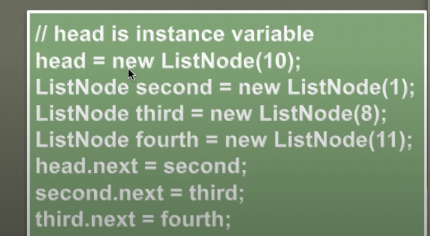
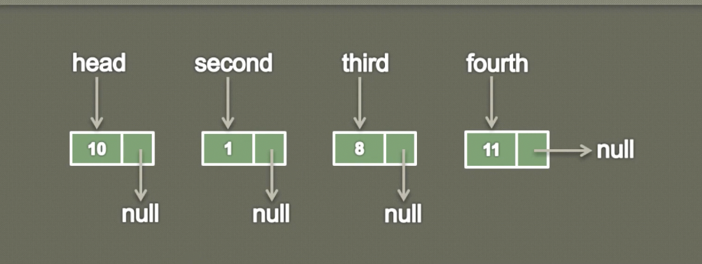

## Simple Singly Linked List
- So here you can see a simple singly linked list

#
- In our old lesson we learned what is a singly linked list.
- We learned that a singly linked list is a data structure which actually stores collection of data.
- It contains sequence of nodes, so here you can see that there are four nodes having data 10,1,8 and 11.
- And you can also see the first node is being referred to by the head
- We also learned that node is having two properties one is the data property and one is the reference to the next node in the list.
- Let's see a demo of how to create a singly linked list having the data as 10,1,8 and 11.
- So, here is the code which can add few nodes in the singly linked list.

#
- We will also learn the other ways to insert the node into the singly linked list.
- So let's see the demo of the code step by step
- so when we intialize a singly linked list
- it contains an instance varriable head which is of type ListNode 
- and when we intialize the singly linked list usually head points to null.
- Because at the intialization of the singly linked list there are no elements in to to the list
- So at first head points to null [head->null] moving ahead
- Now in this step what we do is we first create a new ListNode and we pass the data into it.
- So here we are creating a new ListNode and we're passing data as 10
- so it would look something like this you can see the data is 10.
[head->null]
[10[null]]
- and whenever we create a new ListNode its next points to null
- and also here you can see when we're creating this new ListNode we are assigning its value to the head.
- so currently head points to null
- after this assignment it would look something like this: 
[ head->[10[null]] ]
- so now the head would point to this first node, which is having data as 10 and next pointing to null.
- Moving ahead

- And in this step we are ahain creating a new ListNode.
- and we are assigning its value to the ListNode by name second.
- So it would something like this: 
[ head->[10[null]] ]

[second ->[1[null]]]

- The second is pointing to ListNode having data as, 1 and whose next is pointing to null.
- Moving ahead.

- Now, here similarly we are creating third ListNode having a data as 8, and we are naming the varriable as,third
- So it would look something like this:
[ head->[10[null]] ]

[ second ->[1[null]] ]

[ third ->[8[null]] ]
- That third is pointing to a node having data as 8 and whose next is point to null
- Moving ahead.

- And now we are creating a ListNode having data as,11 and we are assigning its value to a ListNode by name fourth.
- So here you can see that ListNode fourth having data as, 11. and whose next is pointing to null.
[ head->[10[null]] ]

[ second ->[1[null]] ]

[ third ->[8[null]] ]

[fourth ->[11[null]]]
- Graphical impression

- So this is how ListNode created, we create a ListNode by passing into data and whose next always points to null
- Moving ahead.

-So, in order to create a singly linked list what we do is like we connect all this 4 nodes together and form a chain.
- So this chain has built something like this 
- We connect the first node to second, second node to third,third to fourth,like that.
- So in order to archive that, what we do is her,we know that head points to a node having data as, 10 and who's next is pointing to null.
- So in order to connect these two nodes, what we do is we assign the value of second to head next.
- So here you can see second is pointing to the node having data as 1 and the head next is pointing to null.
- So if we assign the value of second to heads next.
- So instead of pointing to null now, it will point to the second node,because the second is pointing to this node, moving ahead
- And now in this step what we do is we assign the value of thirds to seconds next.
- So here seconds next is pointing to null and third is pointing to a node having data as 8.
- So whatever value is in the third we assign it to seconds next.
- So it would look something like this
- Moving ahead.

- And in the final step what we do we assign the value of fourth to thirds next.
- So this fourth ListNode is pointing to a node having data as 11 and, whose next is pointing to null.
- So we simply assign the value of fourth to thirds next.
- So it would look something like this, so finally the third node is pointing to node 4
- So when the method ends, all these 3 nodes go away.
- and as the head is an instance varriable of the singly linked list, it is holding the complate list together. 
- So let's go to the VsCode and see the working code.
